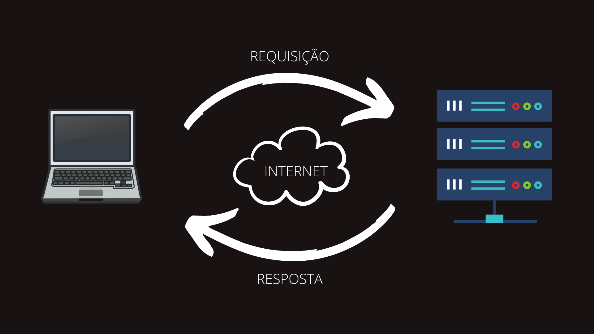
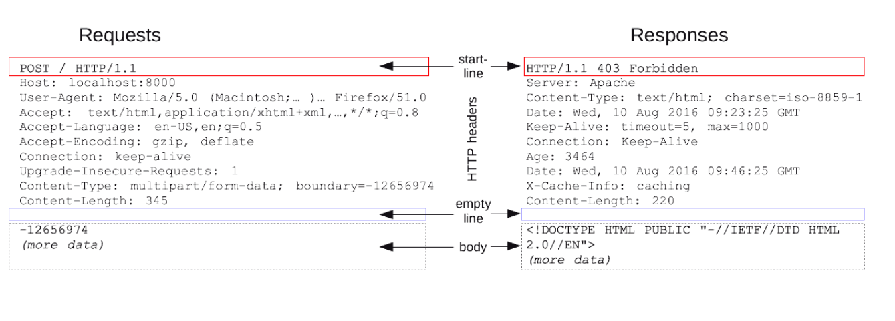
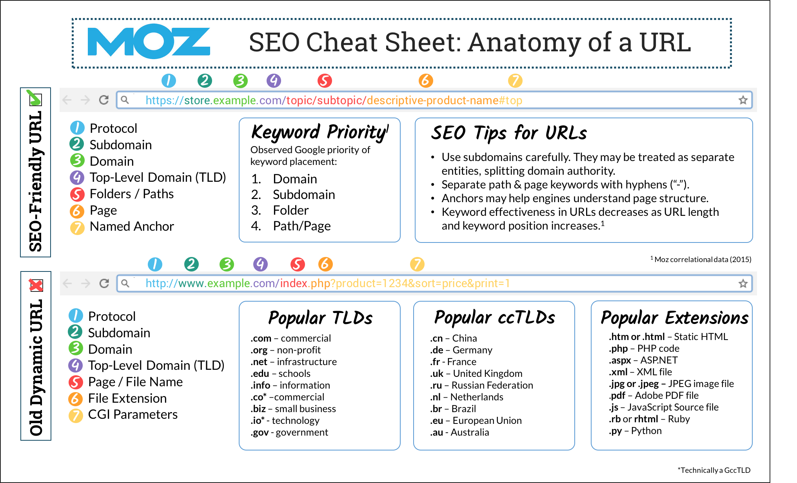

# Módulo 10 - Programação Web I - Aula 01

## Tecnologias Web

Para desenvolvermos nossas aplicações para a web, podemos dispor de inúmeras tecnologias disponíveis (Node.js, Java, C#, etc). Neste curso, utilizaremos o Node.js que, como vimos anteriormente, é um runtime JavaScript, pensado para rodar código JS fora do navegador. O Node.js nos permite utilizar JavaScript como linguagem **server-side**.

&nbsp;

## Arquitetura cliente-servidor

Para entendermos melhor o que significa o termo **server-side**, precisamos entender a arquitetura cliente-servidor. Tal modelo se refere a uma arquitetura de aplicação, na qual o processo da informação é separado por módulos distintos. Um módulo é responsável pelo armazenamento e manutenção dos dados (servidores) e o outro, pela obtenção e exibição destes (cliente).

&nbsp;

## Implementando um servidor web com o módulo HTTP

Antes de iniciar, o que são Módulos JavaScript?
Quando o JavaScript começou a ser utlizado, era normalmente utilizado em pequenos blocos de scripts para resolver problemas pontuais. Ao passo que começou a ser utilizado em contextos maiores, como em aplicações Node.js por exemplo, tornou-se necessário separar o código em partes que implementam funcionalidades específicas e que pudessem ser reaproveitadas em várias partes do projeto.

O Node.js tem um módulo integrado chamado HTTP, que permite que o Node.js transfira dados pelo Protocolo HTTP (_Hyper Text Transfer Protocol_). O módulo HTTP disponibiliza funções úteis e classes para construir um servidor HTTP.

Vamos à prática!

&nbsp;

## Implementando um servidor web com o framework Express

Mas e então, o que são Frameworks?
Frameworks são uma espécie de template, que conta com diversas funcionalidades que podem ser utilizados pelo desenvolvedor em seus projetos. Ele conta com ferramentas, sistemas, componentes e guias que agilizam o processo de criação de soluções.
É importante destacar que framework não é a mesma coisa que biblioteca. Em outras palavras, uma biblioteca é feita para trabalhar de forma independente de onde ela será implementada. No entanto, um framework, ao ser adotado, irá reger, conduzir e guiar todo o desenvolvimento da aplicação que está sendo construída com ele.

Algumas tarefas comuns no desenvolvimento web não são suportadas diretamente pelo Node. Se você quiser que a sua aplicação possua diferentes verbos HTTP (por exemplo GET, POST, DELETE, etc), que gerencie requisições de diferentes URLs ("rotas"), apresente arquivos estáticos ou utilize templates para mostrar as respostas (response) de maneira dinâmica, você não terá muita praticidade usando apenas o Node.

Você terá duas opções:

1. Escrever o código por conta própria
2. Evitar todo esse trabalho de "reinventar a roda" e utilizar um framework.

Express é o framework Node mais popular e a biblioteca subjacente para uma série de outros frameworks do Node. O Express oferece soluções para:

- Gerenciar requisições de diferentes verbos HTTP em diferentes URLs.
- Integrar "view engines" para inserir dados nos templates.
- Definir as configurações comuns da aplicação web, como a porta a ser usada para conexão e a localização dos modelos que são usados para renderizar a resposta.
- Adicionar novos processos de requisição por meio de "middleware" em qualquer ponto da "fila" de requisições.

Let's go!

&nbsp;

## Requisição / Resposta

**Imagem 1:** _Fluxo de informações cliente-servidor (fonte da imagem: do autor)_

&nbsp;

Seguindo o fluxo da informação, um cliente (um notebook, no caso) envia uma _request_ (requisição) para o servidor web, através da Internet. Este, por sua vez, processa e envia uma _response_ (resposta) para o cliente. Enquanto o servidor processa a informação, o cliente fica livre pra realizar outras tarefas.

Requests e responses possuem estruturas similares, como podemos ver na imagem a seguir.

&nbsp;

**Imagem 2:** _Estrutura de uma mensagem HTTP (fonte da imagem: [Mdn Web Docs](https://developer.mozilla.org/pt-BR/docs/Web/HTTP/Messages))_

&nbsp;

Detalhando a estrutura de uma mensagem HTTP:

1. Uma linha inicial (start-line) que descreve as requisições a serem implementadas, ou seu status de sucesso ou falha. Esta linha inicial é sempre uma única.
2. Um conjunto opcional de cabeçalhos HTTP especificando a requisição, ou descrevendo o corpo incluso na mensagem.
3. Uma linha em branco (empty line) indicando que toda meta-informação para a requisição já foi enviada.
4. Um corpo (body) contendo dados associados à requisição (como o conteúdo de um formulário HTML), ou o documento associado à resposta. A presença do corpo e seu tamanho são especificados pela linha inicial e os cabeçalhos HTTP.

&nbsp;

## Anatomia de uma URL

URL ou, como também é conhecida, endereço da web, especifica a localização de um recurso uma página da web, por exemplo) na Internet. É um texto legível que substitui o endereço IP, que é o real endereço de um recurso.

&nbsp;

> Para renderizar corretamente em todos os navegadores, os URLs devem ter menos de 2.083 caracteres.

&nbsp;

**Imagem 3:** _Anatomia de uma URL (fonte da imagem: [MOZ](https://moz.com/learn/seo/url))_

&nbsp;

## Bibliografia

- [Node.js](https://nodejs.org/pt-br/)
- [Configurando o Node como ambiente de desenvolvimento](https://developer.mozilla.org/pt-BR/docs/Learn/Server-side/Express_Nodejs/development_environment)
- [O que são Módulos JavaScript?](https://developer.mozilla.org/pt-BR/docs/Web/JavaScript/Guide/Modules)
- [O que são Frameworks?](https://www.hostgator.com.br/blog/frameworks-na-programacao/)
- [Módulo HTTP](https://www.w3schools.com/nodejs/nodejs_http.asp)
- [Arquitetura cliente-servidor](<https://www.canalti.com.br/arquitetura-de-computadores/arquitetura-cliente-servidor/#:~:text=Arquitetura%20cliente%2Dservidor%20ou%20modelo,dos%20dados%20(os%20clientes).>)
- [Mensagens HTTP](https://developer.mozilla.org/pt-BR/docs/Web/HTTP/Messages)
- [Express](https://expressjs.com/)
- [NPM Express](https://www.npmjs.com/package/express)
- [Introduzindo o Express](https://developer.mozilla.org/pt-BR/docs/Learn/Server-side/Express_Nodejs/Introduction)
- [URL](https://moz.com/learn/seo/url)
- [Nodemon Npm](https://www.npmjs.com/package/nodemon)
