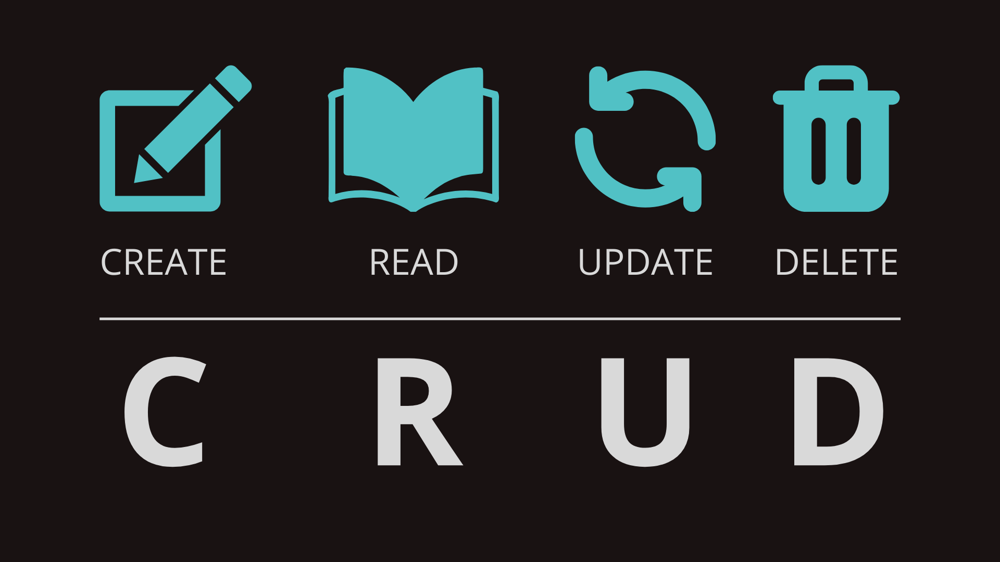

# Módulo 06 - Programação Web I - Aula 02

Na aula anterior, criamos o nosso servidor utilizando o Express. Nele criamos algumas rotas. Observe que as duas rotas iniciavam sua implementação com `app.get()`. Isso porque ambas as rotas eram para leitura de dados apenas.

&nbsp;

## CRUD

Existem outros tipos de rotas. Falamos do "famoso" **CRUD (Create, Read, Update, Delete)**.

&nbsp;



&nbsp;

CRUD é um acrônimo para as maneiras de se operar em informação armazenada. É um mnemônico para as quatro operações básicas de armazenamento persistente. CRUD tipicamente refere-se a operações perfomadas em um banco de dados ou base de dados, mas também pode aplicar-se para funções de alto nível de uma aplicação, como exclusões reversíveis, onde a informação não é realmente deletada, mas é marcada como deletada via status.

- **C**reate - Criar ou adicionar um novo recurso
- **R**ead (**R**etrieve) - Ler, recuperar ou visualizar recursos existentes
- **U**pdate - Atualizar ou editar recursos existentes
- **D**elete - Remover um recurso existente

&nbsp;

## Verbos HTTP

O protocolo HTTP define um conjunto de **métodos de requisição** responsáveis por indicar a ação a ser executada para um dado recurso. Embora esses métodos possam ser descritos como substantivos, eles também são comumente referenciados como **HTTP Verbs (Verbos HTTP)**.
Os verbos HTTP são: **GET, HEAD, POST, PUT, DELETE, CONNECT, OPTIONS, TRACE, PATCH**. Abordaremos neste módulo apenas os mais utilizados.

&nbsp;

### GET

O método GET solicita a representação de um recurso específico. Requisições utilizando o método GET devem retornar apenas dados.

&nbsp;

### POST

O método POST é utilizado para submeter uma entidade a um recurso específico, frequentemente causando uma mudança no estado do recurso ou efeitos colaterais no servidor.

&nbsp;

### PUT

O método PUT substitui todas as atuais representações do recurso de destino pela carga de dados da requisição.

&nbsp;

### PATCH

O método PATCH é utilizado para aplicar modificações parciais em um recurso.

&nbsp;

### DELETE

O método DELETE remove um recurso específico.

&nbsp;

| CRUD            | Ações     | HTTP Methods / Verbs             |
| --------------- | --------- | -------------------------------- |
| Create          | Criar     | POST                             |
| Read / Retrieve | Recuperar | GET                              |
| Update          | Atualizar | PUT (Completa) / PATCH (Parcial) |
| Delete          | Excluir   | DELETE                           |

&nbsp;

## Basic routing

O Roteamento refere-se à determinação de como um aplicativo responde a uma solicitação do cliente por um endpoint específico, que é uma URI (ou caminho) e um método de solicitação HTTP específico (GET, POST, e assim por diante).

Cada rota pode ter uma ou mais funções de manipulação, que são executadas quando a rota é correspondida.

&nbsp;

_Estrutura de uma rota_

```
app.METHOD(PATH, HANDLER)
```

&nbsp;

_Exemplos de rotas_

```js
// Sintaxe usando "function"
app.get("/", function (req, res) {
  res.send("Hello World");
});

// Sintaxe usando arrow function
app.get("/", (req, res) => {
  res.send("Hello World");
});
```

&nbsp;

## Nodemon

Nodemon é uma ferramenta que ajuda a desenvolver aplicativos baseados em Node.js reiniciando automaticamente o aplicativo de nó quando são detectadas alterações de arquivo no diretório.

```
npm i nodemon
```

&nbsp;

## Thunder client

O Thunder Client é uma extensão de cliente de API Rest leve para Visual Studio Code, criada à mão por Ranga Vadhineni com design simples e limpo. O código-fonte não é de código aberto. Você pode relatar quaisquer solicitações de Bugs ou Recursos aqui.

&nbsp;

## Bibliografia

- [CRUD (Mdn)](https://developer.mozilla.org/pt-BR/docs/Glossary/CRUD)
- [CRUD (Wikipedia)](https://pt.wikipedia.org/wiki/CRUD)
- [Métodos de requisição HTTP](https://developer.mozilla.org/pt-BR/docs/Web/HTTP/Methods)
- [Roteamento Básico](https://expressjs.com/pt-br/starter/basic-routing.html)
- [Roteamento](https://expressjs.com/pt-br/guide/routing.html)
- [express()](https://expressjs.com/pt-br/4x/api.html#res.sendStatus)
- [Nodemon Npm](https://www.npmjs.com/package/nodemon)
- [Thunder Client](https://www.thunderclient.com/)
- [Body-parser](https://www.npmjs.com/package/body-parser)
